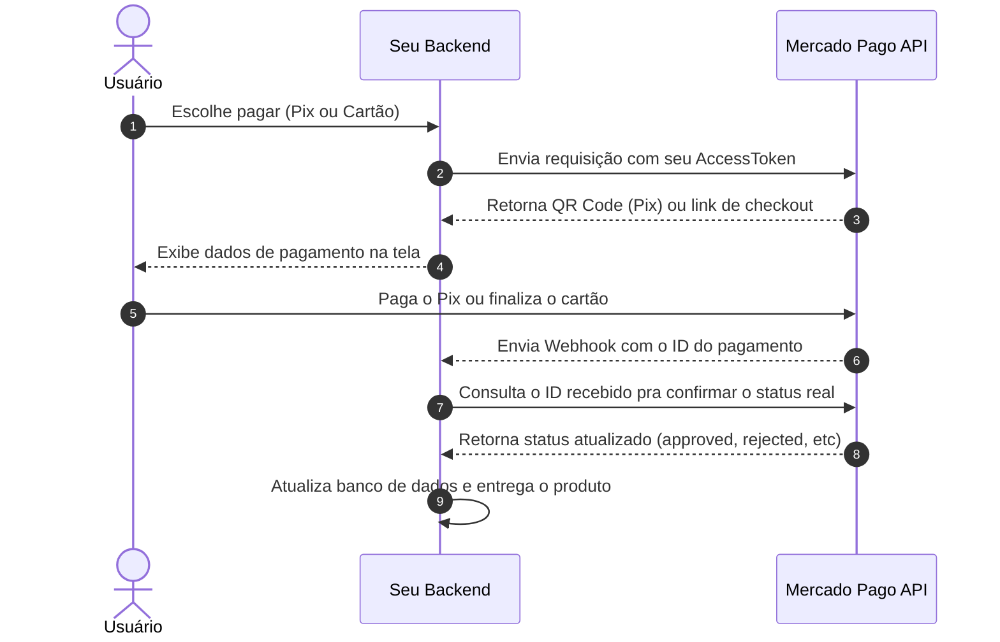

Integrar gateway de pagamento costuma ser uma tarefa chata, mas com o Mercado Pago a experiência consegue ser pior por conta de uma documentação oficial bagunçada, fragmentada e cheia de links quebrados. Pra ajudar a comunidade (e economizar o tempo de outros devs), montei esse guia direto ao ponto.

Aqui você vai encontrar o caminho das pedras para integrar os fluxos mais comuns usando a versão mais recente das SDKs oficiais em **7 linguagens**.

---

## As principais pegadinhas da API oficial

Se você está quebrando a cabeça na integração, provavelmente esbarrou em uma dessas coisas:

1. **Tutoriais antigos na internet:** A transição da v1 (chamadas estáticas como `mercadopago.payment.create()`) para a v2 (orientada a instâncias de clientes) quebrou quase todos os vídeos do YouTube.
2. **Falta de segurança nos Webhooks:** A maioria dos tutoriais ensina a receber a notificação e já liberar o produto no banco sem validar se a requisição realmente veio do Mercado Pago. Isso é um prato cheio pra fraudes.
3. **Tipagens TypeScript fracas:** Apesar de a SDK v2 de Node.js vir com suporte nativo a TypeScript, a documentação deles não ensina a usá-la sem encher o código de `any`.

---

## O Fluxo de Pagamento Ideal

No mundo real, a comunicação entre o seu sistema e o Mercado Pago funciona assim:

---

## Como usar este guia?

Use o menu lateral para seguir o passo a passo. Se você trabalha com **Node.js (TypeScript)** ou **Python (FastAPI)**, as pastas de exemplos contêm projetos de backend prontos e funcionais que você pode rodar na hora. Para as outras linguagens (PHP, Java, Go, .NET, Ruby), fornecemos os blocos de código exatos dentro dos seletores de abas em cada página.
