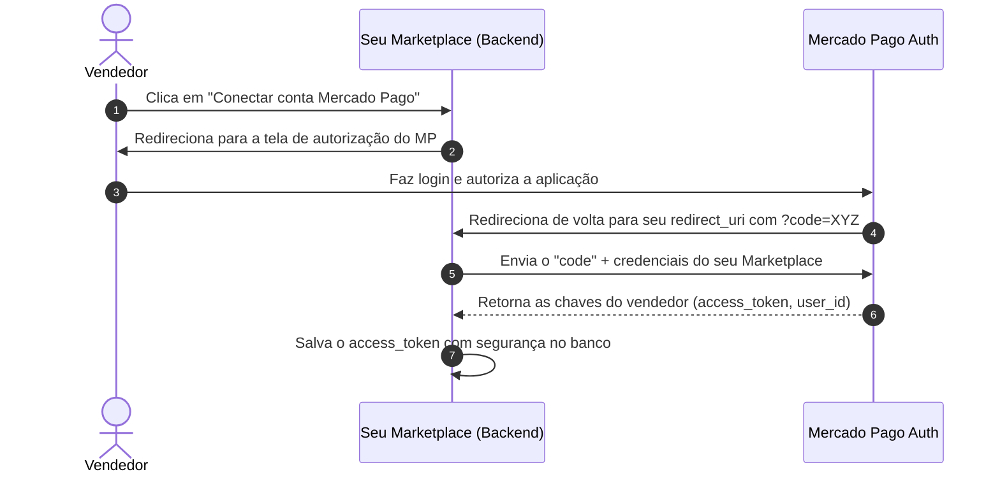

import { Tabs, TabItem } from '@astrojs/starlight/components';

Se você está criando um **Marketplace** (onde outros vendedores usam sua plataforma para vender produtos e receber direto nas contas deles), você precisa usar o fluxo de **OAuth 2.0**.

Com ele, o vendedor autoriza sua aplicação a agir em seu nome. No final, você ganha o `access_token` e o `refresh_token` do vendedor. Isso te permite criar pagamentos em nome dele e cobrar sua comissão de forma automática.

---

## Como funciona a integração?



---

## 1. Redirecionando o vendedor para autorização

No seu frontend, crie um link enviando o vendedor para a URL do Mercado Pago. Lembre de ajustar os parâmetros:

```html
<a href="https://auth.mercadopago.com/authorization?client_id=SEU_CLIENT_ID&response_type=code&platform_id=mp&state=HASH_DE_SEGURANCA&redirect_uri=SUA_URL_DE_RETORNO">
  Conectar conta Mercado Pago
</a>
```

- **`client_id`:** O ID da sua aplicação (encontrado nas configurações do app no painel do MP).
- **`redirect_uri`:** URL de callback da sua API cadastrada no painel. O MP vai redirecionar o usuário pra cá após o aceite.
- **`state`:** Um token aleatório criado por você para validar que a requisição de retorno é legítima (proteção contra CSRF).

---

## 2. Trocando o `code` pelas chaves do vendedor

Depois que o vendedor clica em autorizar, ele é mandado de volta para a sua API com o código temporário na query: `https://seusite.com/callback?code=TG-xxxxx`.

Seu backend precisa pegar esse `code` e mandar um POST para obter o token de acesso final. Veja como fazer isso em cada linguagem:

<Tabs>
  <TabItem label="Node.js (TypeScript)">
    ```typescript
    import { OAuth } from 'mercadopago';
    import { mpClient } from './configuracao'; // Instância base do Marketplace

    const oauth = new OAuth(mpClient);

    const getSellerCredentials = async (code: string) => {
      try {
        const response = await oauth.create({
          body: {
            client_id: process.env.MERCADOPAGO_CLIENT_ID || '',
            client_secret: process.env.MERCADOPAGO_ACCESS_TOKEN || '', // Seu Access Token de Marketplace
            code: code,
            grant_type: 'authorization_code',
            redirect_uri: 'https://sua-api.com/oauth/callback'
          }
        });

        // Salve essas informações de forma criptografada vinculadas ao usuário
        console.log('Access Token do Vendedor:', response.access_token);
        console.log('Refresh Token do Vendedor:', response.refresh_token);
        console.log('User ID do Vendedor:', response.user_id);
      } catch (error) {
        console.error('Erro na autenticação OAuth:', error);
      }
    };
    ```
  </TabItem>

  <TabItem label="Python">
    ```python
    import os
    from configuracao import sdk

    def obter_credenciais_vendedor(code: str):
        try:
            response = sdk.oauth().create({
                "client_id": os.getenv("MERCADOPAGO_CLIENT_ID"),
                "client_secret": os.getenv("MERCADOPAGO_ACCESS_TOKEN"),
                "code": code,
                "grant_type": "authorization_code",
                "redirect_uri": "https://sua-api.com/oauth/callback"
            })
            
            credenciais = response["response"]
            
            # Salvar no banco vinculado ao vendedor
            print("Access Token:", credenciais["access_token"])
            print("Refresh Token:", credenciais["refresh_token"])
            print("User ID:", credenciais["user_id"])
        except Exception as e:
            print("Erro ao processar OAuth:", e)
    ```
  </TabItem>

  <TabItem label="PHP">
    ```php
    use MercadoPago\Client\OAuth\OAuthClient;

    $client = new OAuthClient();

    try {
        $credentials = $client->create([
            "client_id" => getenv('MERCADOPAGO_CLIENT_ID'),
            "client_secret" => getenv('MERCADOPAGO_ACCESS_TOKEN'),
            "code" => $_GET['code'],
            "grant_type" => "authorization_code",
            "redirect_uri" => "https://sua-api.com/oauth/callback"
        ]);

        // Salvar os dados de acesso com segurança
        echo "Access Token: " . $credentials->access_token;
        echo "Refresh Token: " . $credentials->refresh_token;
        echo "User ID: " . $credentials->user_id;
    } catch (Exception $e) {
        echo "Erro de autenticação: " . $e->getMessage();
    }
    ```
  </TabItem>

  <TabItem label="Java">
    ```java
    import com.mercadopago.client.oauth.OAuthClient;
    import com.mercadopago.resources.oauth.OAuthCredentials;

    public class Security {
        public void obterCredenciais(String code) {
            OAuthClient client = new OAuthClient();

            try {
                OAuthCredentials credentials = client.create(
                    System.getenv("MERCADOPAGO_CLIENT_ID"),
                    System.getenv("MERCADOPAGO_ACCESS_TOKEN"),
                    code,
                    "https://sua-api.com/oauth/callback"
                );

                System.out.println("Access Token: " + credentials.getAccessToken());
                System.out.println("Refresh Token: " + credentials.getRefreshToken());
                System.out.println("User ID: " + credentials.getUserId());
            } catch (Exception e) {
                e.printStackTrace();
            }
        }
    }
    ```
  </TabItem>

  <TabItem label="Go">
    ```go
    package main

    import (
    	"context"
    	"fmt"
    	"os"
    	"github.com/mercadopago/sdk-go/pkg/oauth"
    )

    func ObterCredenciaisVendedor(code string) {
    	client := oauth.NewClient()

    	credentials, err := client.Create(context.Background(), oauth.Request{
    		ClientID:     os.Getenv("MERCADOPAGO_CLIENT_ID"),
    		ClientSecret: os.Getenv("MERCADOPAGO_ACCESS_TOKEN"),
    		Code:         code,
    		RedirectURI:  "https://sua-api.com/oauth/callback",
    	})
    	if err != nil {
    		panic("Erro no OAuth: " + err.Error())
    	}

    	fmt.Println("Access Token:", credentials.AccessToken)
    	fmt.Println("Refresh Token:", credentials.RefreshToken)
    	fmt.Println("User ID:", credentials.UserID)
    }
    ```
  </TabItem>

  <TabItem label=".NET (C#)">
    ```csharp
    using System;
    using System.Threading.Tasks;
    using MercadoPago.Client.OAuth;
    using MercadoPago.Resource.OAuth;

    public class Security {
        public async Task ObterCredenciais(string code) {
            var client = new OAuthClient();

            try {
                OAuthCredentials credentials = await client.CreateAsync(
                    Environment.GetEnvironmentVariable("MERCADOPAGO_CLIENT_ID"),
                    Environment.GetEnvironmentVariable("MERCADOPAGO_ACCESS_TOKEN"),
                    code,
                    "https://sua-api.com/oauth/callback"
                );

                Console.WriteLine($"Access Token: {credentials.AccessToken}");
                Console.WriteLine($"Refresh Token: {credentials.RefreshToken}");
                Console.WriteLine($"User ID: {credentials.UserId}");
            } catch (Exception e) {
                Console.WriteLine($"Erro no callback: {e.Message}");
            }
        }
    }
    ```
  </TabItem>

  <TabItem label="Ruby">
    ```ruby
    def obter_credenciais_vendedor(code)
      response = sdk.oauth.create(
        client_id: ENV['MERCADOPAGO_CLIENT_ID'],
        client_secret: ENV['MERCADOPAGO_ACCESS_TOKEN'],
        code: code,
        grant_type: 'authorization_code',
        redirect_uri: 'https://sua-api.com/oauth/callback'
      )
      
      credenciais = response[:response]
      puts "Access Token: #{credenciais['access_token']}"
      puts "Refresh Token: #{credenciais['refresh_token']}"
      puts "User ID: #{credenciais['user_id']}"
    rescue => e
      puts "Erro no OAuth: #{e.message}"
    end
    ```
  </TabItem>
</Tabs>

---

## 🔒 Dicas de Segurança e Arquitetura

* **Criptografe tudo:** Tokens de acesso do OAuth dão controle sobre as finanças do vendedor. Nunca salve em texto simples no seu banco de dados. Use algoritmos fortes como **AES-256-GCM** para criptografar os tokens antes de salvar.
* **Renove os tokens:** O token de acesso expira a cada 180 dias. Crie um script de background agendado (Cron Job) pra rodar a cada 30 ou 60 dias que pegue o `refresh_token` de cada vendedor ativo e faça a renovação preventiva.
